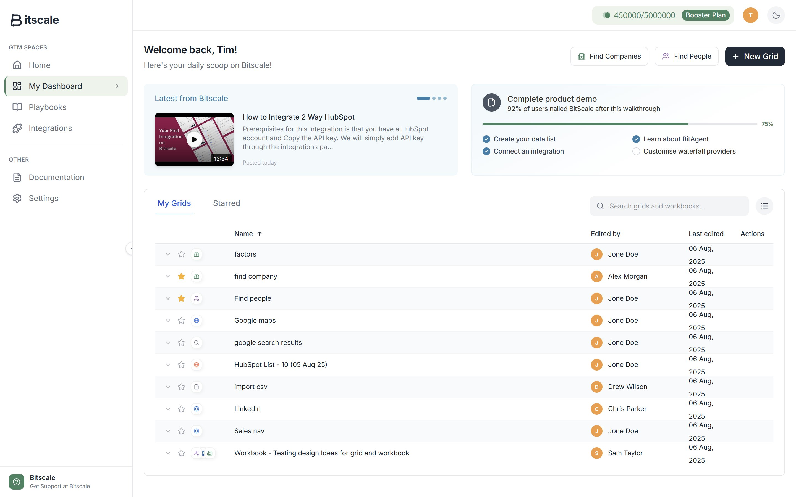
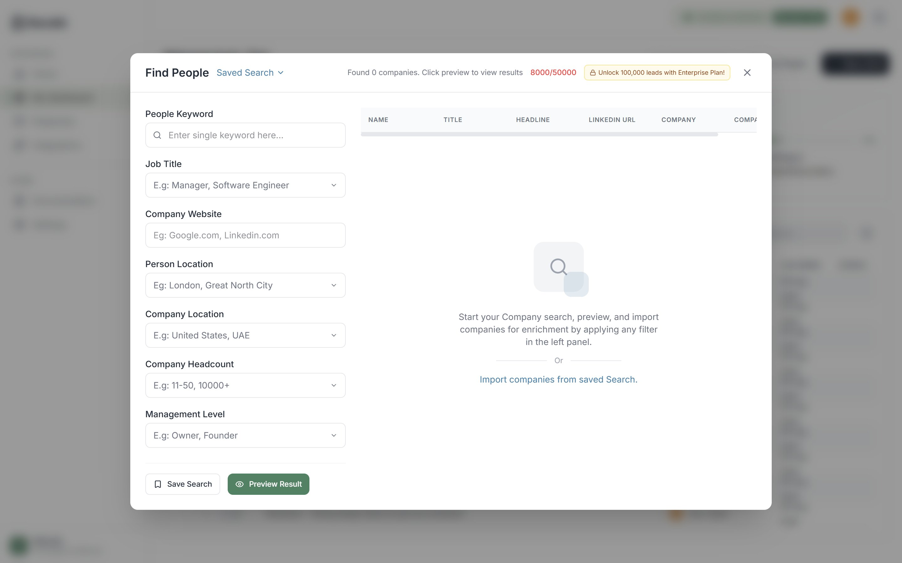

# Bitscale GTM Dashboard

A pixel-perfect, production-quality React implementation of the Bitscale GTM Dashboard, built from a Figma design with creative enhancements on top.

---

## 📸 Overview

This project replicates the Bitscale dashboard UI — a Go-To-Market (GTM) platform that helps teams manage grids, workbooks, and data pipelines. The implementation faithfully follows the Figma design while adding a layer of modern UX improvements including dark mode, animations, a command palette, and interactive onboarding.

---

## 📷 Screenshots

### Main Dashboard


> The main dashboard view showing the Bitscale logo, collapsible sidebar with GTM Spaces navigation, welcome header with "Find Companies", "Find People", and "+ New Grid" action buttons, the "Latest from Bitscale" tutorial video card, the interactive "Complete product demo" onboarding checklist with dynamic progress bar, and the full "My Grids" data table with type icons, starred rows, editor avatars, and last-edited timestamps.

---

### Find People Modal


> The "Find People" overlay modal showing the left-side filter panel (People Keyword, Job Title, Company Website, Person Location, Company Location, Company Headcount, Management Level) with "Save Search" and "Preview Result" action buttons. The right panel shows the results table with NAME, TITLE, HEADLINE, LINKEDIN URL, COMPANY columns, and an empty-state illustration prompting users to apply filters to start their search. The header displays the live search credit counter (8000/50000) and the "Unlock 100,000 leads with Enterprise Plan!" upsell badge.

---

## 🚀 Features

### Core (Figma-Faithful)
- **Dashboard Layout** — Sidebar + Header + Content area, pixel-perfect to the Figma spec
- **Collapsible Sidebar** — Navigation with Home, Playbooks, Integrations, Documentation, and Settings
- **Grids Table** — Sortable data table with type icons, editor avatars, and last-edited timestamps
- **Info Cards** — "Latest from Bitscale" carousel card and "Complete Product Demo" progress card
- **Find People Modal** — Full overlay with left-panel filters (industry, location, company size, revenue) and right-panel results table
- **Tabs** — "My Grids" / "Shared" tab switcher above the table

### Creative Enhancements
| Feature | Description |
|---|---|
| 🌙 Dark / Light Mode | One-click toggle; persists across sessions |
| ⌨️ Command Palette | `Ctrl+K` / `Cmd+K` opens a searchable action launcher |
| ✨ Framer Motion Animations | Staggered row entries, modal slide-up, sidebar transitions |
| 💀 Skeleton Loading | Shimmer placeholders on first render |
| 🟢 Toast Notifications | Success/error toasts (e.g., "Grid created successfully") |
| ➕ New Grid Modal | Opens a modal, accepts a name, persists the new row to `localStorage` |
| ⭐ Star / Favourite Grids | Click the star icon on any row to favourite it |
| 🔍 Live Search | Filters the grid table in real time |
| 📊 Dynamic Progress Bar | Onboarding checklist — checking all 4 tasks animates the bar to 100% |
| 🎬 Embedded YouTube | Tutorial video card plays inline inside the dashboard |

---

## 🛠️ Tech Stack

| Layer | Choice |
|---|---|
| Framework | React 19 |
| Language | TypeScript |
| Bundler | Vite |
| Styling | Tailwind CSS v4 |
| Animations | Framer Motion |
| Icons | Lucide React |
| State | React Context + `useState` / `useReducer` |
| Persistence | `localStorage` |

---

## 📁 Project Structure

```
bitscale-dashboard/
├── public/
├── src/
│   ├── components/
│   │   ├── common/          # Reusable UI primitives
│   │   │   ├── Button.tsx
│   │   │   ├── Modal.tsx
│   │   │   ├── Toast.tsx
│   │   │   ├── CommandPalette.tsx
│   │   │   ├── Skeleton.tsx
│   │   │   └── ThemeToggle.tsx
│   │   ├── layout/          # App shell
│   │   │   ├── Sidebar.tsx
│   │   │   ├── DashboardHeader.tsx
│   │   │   └── AppLayout.tsx
│   │   ├── dashboard/       # Dashboard-specific components
│   │   │   ├── WelcomeSection.tsx
│   │   │   ├── TutorialCard.tsx
│   │   │   ├── OnboardingCard.tsx
│   │   │   ├── GridTable.tsx
│   │   │   ├── GridRow.tsx
│   │   │   ├── TabBar.tsx
│   │   │   └── NewGridModal.tsx
│   │   └── findpeople/      # Find People modal feature
│   │       ├── FindPeopleModal.tsx
│   │       ├── FilterPanel.tsx
│   │       ├── ResultsTable.tsx
│   │       └── EmptyState.tsx
│   ├── context/
│   │   ├── ThemeContext.tsx
│   │   ├── GridContext.tsx
│   │   ├── ToastContext.tsx
│   │   └── CommandPaletteContext.tsx
│   ├── hooks/
│   │   ├── useLocalStorage.ts
│   │   ├── useKeyboardShortcut.ts
│   │   └── useFocusTrap.ts
│   ├── data/
│   │   └── mockData.ts      # All static mock data
│   ├── types/
│   │   └── index.ts
│   ├── App.tsx
│   └── main.tsx
├── index.html
├── tailwind.config.ts
├── vite.config.ts
├── tsconfig.json
└── package.json
```

---

## ⚙️ Getting Started

### Prerequisites
- Node.js 18+
- npm or yarn

### Installation

```bash
# 1. Unzip the project
unzip bitscale-dashboard.zip
cd bitscale-dashboard

# 2. Install dependencies
npm install

# 3. Start the development server
npm run dev
```

The app will be available at **http://localhost:5173**

### Build for Production

```bash
npm run build
# Output: dist/ folder (~115 KB gzip)
```

---

## 🎮 How to Use

### Navigation
- Click sidebar items (**Playbooks**, **Integrations**, **Documentation**, **Settings**) to navigate to placeholder pages
- Click the **chevron** on the sidebar edge to collapse/expand it

### Grids Table
- Use the **search bar** to filter grids in real time
- Click the **Name** column header to sort
- Click the **⋯ menu** on any row for row actions
- Click the **⭐ star** icon to favourite a grid
- Click **+ New Grid** → enter a name → the new row appears and is saved to `localStorage`

### Find People Modal
- Click the **"Find People"** button in the welcome section header
- Apply filters in the left panel (industry, location, company size, revenue range)
- Click **Preview** to see results in the right table
- Press **ESC** or click outside to close

### Onboarding Card
- Click any of the 4 checklist items in the "Complete product demo" card to toggle them
- The progress bar and percentage update dynamically
- All 4 checked = 100% complete

### Dark Mode
- Click the **moon / sun icon** in the top-right header

### Command Palette
- Press **`Ctrl+K`** (Windows/Linux) or **`Cmd+K`** (Mac)
- Type to search actions, then press **Enter** or click to execute

---

## ♿ Accessibility

- Keyboard navigation throughout (Tab, Enter, Space, Arrow keys)
- Focus trapping inside all modals
- **ESC** closes any open modal or the command palette
- Semantic HTML elements (`<nav>`, `<main>`, `<table>`, `<button>`)
- ARIA labels on icon-only buttons
- WCAG AA colour contrast ratios maintained in both light and dark modes

---

## 🎨 Design Tokens

| Token | Value |
|---|---|
| Primary Green | `#438361` |
| Active Blue | `#1A56DB` |
| Section Blue | `#347FA9` |
| Purple (People) | `#8F65AF` |
| Dark Text | `#1A202C` |
| Muted Text | `#6B7280` |
| Border | `#E5E7EB` |
| Row Alt BG | `#F9FAFB` |
| Font (UI) | Inter |
| Font (Badge) | Lato |

---

## 📋 Design Decisions & Trade-offs

- **Modal-only routing** — The "Find People" screen is an overlay, matching the Figma intent rather than a separate route, keeping the URL clean.
- **Static mock data** — All grid rows, filter options, and user data are hardcoded in `mockData.ts` for a self-contained demo with no backend dependency.
- **localStorage for grids** — New grids created via the modal are persisted so they survive page refreshes, demonstrating real product thinking.
- **`display: none` AI button not implemented** — The Figma shows a gradient AI orb button with `display: none`; it was omitted as it is not part of the visible design.

---

## 📦 Bundle Size

| Asset | Size (gzip) |
|---|---|
| JavaScript | ~95 KB |
| CSS | ~20 KB |
| **Total** | **~115 KB** |

---

## 🔗 Figma Reference

[FE Assignment Figma File](https://www.figma.com/design/fSEdXdfmuufDStswBHN5KR/FE-Assigment?node-id=0-1&p=f&t=clBVwd0YOQ94bPh5-0)

---

## 👤 Author

Built as part of a frontend engineering assignment — implementing a pixel-perfect Figma design in React with production-quality code and UX enhancements.